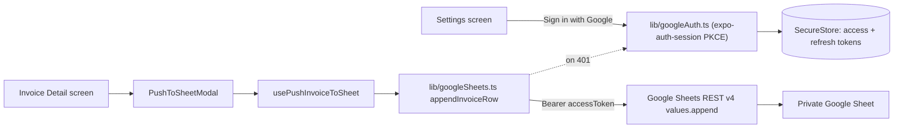

## Architecture

Use the **Google Sheets REST API v4** directly with **OAuth 2.0 (PKCE)** via `expo-auth-session`. The signed-in Google user must have edit access to the target sheet (trivially true here — you own it). The app stores `accessToken` / `refreshToken` in SecureStore and calls `values.append` on range `{tab}!A:F` with a 6-cell array so only columns A/D/E/F get values and columns B/C (blank) + G/H/I (untouched) preserve any existing formulas.

No Apps Script, no deployed Web App, no shared-secret URL, no custom server-side code to maintain.



## Why Sheets REST instead of Apps Script

Both options need OAuth in this setup. Given that, the REST API wins on: fewer artifacts to maintain (no deployed script), cleaner error surface (structured JSON errors), better scope semantics (`spreadsheets` scope actually does the work rather than `drive.file` only proving identity), and free future read access for features like listing tabs or validating the header. Apps Script would only win if you needed server-side logic or one shared writer identity for many users — neither applies here.

## Auth flow (OAuth 2.0 PKCE via expo-auth-session)

- Deps: `expo-auth-session` (new), `expo-web-browser` + `expo-crypto` (verify present; peers of auth-session).
- Google Cloud project requirements (one-time, documented in `docs/google-sheets-integration.md`):
  - Enable **Google Sheets API**.
  - OAuth **consent screen** (External, Testing mode is fine; add your Google account to Test users until verified).
  - OAuth 2.0 Client IDs: **iOS** (bundle id), **Android** (package name + SHA-1), **Web** (used by Expo's auth proxy in dev / Expo Go).
- Scopes requested: `openid`, `email`, `profile`, `https://www.googleapis.com/auth/spreadsheets`.
- Flow: `AuthSession.useAuthRequest` with `ResponseType.Code` + PKCE -> exchange at `https://oauth2.googleapis.com/token` -> persist `{ accessToken, refreshToken, expiresAt, email }` in SecureStore.
- Token refresh: `lib/googleAuth.ts#getValidAccessToken()` refreshes via refresh token when `expiresAt < now + 60s`. If refresh fails, clears tokens and returns null (caller must re-sign-in).
- Sign out: revoke token at `https://oauth2.googleapis.com/revoke` then clear SecureStore.

Client IDs are read from `app.json` `expo.extra` via `expo-constants` — **never hardcoded in source**. URL scheme for redirect is configured in `app.json` (`scheme: "invoicescanner"`).

## Field mapping (app -> sheet columns)

- Column A `Ngày tháng` <- `invoice.invoice_date`
- Column D `Tên hóa đơn` <- `invoice.vendor_name` (fallback `invoice.invoice_number`)
- Column E `tiền hóa đơn` <- `invoice.total_amount`
- Column F `Người thanh toán` <- user types in confirmation modal (no matching invoice field)
- Columns B, C sent as empty strings; columns G, H, I never part of the write range, so any existing formulas there (Số dư quỹ / Quỹ bị âm) stay intact.

## Append request shape

```
POST https://sheets.googleapis.com/v4/spreadsheets/{spreadsheetId}/values/{encodedTab}!A:F:append
     ?valueInputOption=USER_ENTERED
     &insertDataOption=INSERT_ROWS
Authorization: Bearer {accessToken}
Content-Type: application/json

{ "values": [[date, "", "", name, amount, payer]] }
```

Tab name is percent-encoded (includes Vietnamese characters) and single-quoted if it contains spaces: `'Thu chi mua linh kiện'!A:F`.

## Changes in the Expo app

### 1. Dependencies and config

- `npx expo install expo-auth-session expo-crypto` (verify `expo-web-browser` already installed — it is).
- Edit `app.json`:
  - `"scheme": "invoicescanner"` (top-level) for the OAuth redirect.
  - `"extra": { "googleIosClientId": "...", "googleAndroidClientId": "...", "googleWebClientId": "..." }` — values filled in by the user, documented as placeholders.

### 2. Constants

In [lib/constants.ts](lib/constants.ts), add:

- `GOOGLE_SPREADSHEET_ID_STORAGE_KEY = 'google_spreadsheet_id_secure_v1'` (SecureStore).
- `GOOGLE_SHEET_TAB_STORAGE_KEY = 'google_sheet_tab_v1'` (storage helper, non-secret).
- `GOOGLE_AUTH_TOKENS_STORAGE_KEY = 'google_auth_tokens_secure_v1'` (SecureStore; stores `{ accessToken, refreshToken, expiresAt, email }`).
- `DEFAULT_GOOGLE_SHEET_TAB = 'Thu chi mua linh kiện'`.
- `GOOGLE_OAUTH_SCOPES = ['openid', 'email', 'profile', 'https://www.googleapis.com/auth/spreadsheets']`.
- `GOOGLE_SHEETS_API_BASE = 'https://sheets.googleapis.com/v4/spreadsheets'`.
- Typed `googleClientIds` reader from `Constants.expoConfig?.extra`.

### 3. Google auth library

New `lib/googleAuth.ts`:

```ts
export interface GoogleAccount { email: string; accessToken: string; }

export async function loadStoredAccount(): Promise<GoogleAccount | null>;
export async function getValidAccessToken(): Promise<string | null>;
export async function persistTokensFromCodeExchange(
  code: string,
  verifier: string,
  redirectUri: string,
): Promise<GoogleAccount>;
export async function signOut(): Promise<void>;

export class GoogleAuthRequiredError extends Error {}
```

Uses `AuthSession.exchangeCodeAsync` / `refreshAsync`. Email parsed from `id_token` JWT payload (no network call). Tokens only ever touch SecureStore; never logged.

### 4. Google auth hook

New `hooks/settings/useGoogleAuth.ts`:

```ts
const { account, isSigningIn, error, signIn, signOut } = useGoogleAuth();
```

- Wraps `AuthSession.useAuthRequest` with PKCE and the Google discovery document.
- Picks the right client ID per platform (`Platform.select` against `googleClientIds`).
- `signIn()` triggers the browser flow; on success, exchanges the code and persists tokens via `lib/googleAuth.ts`.
- Hydrates `account` from SecureStore on mount.

### 5. Sheets config hook

New `hooks/settings/useGoogleSheetsConfig.ts` — load/save `{ spreadsheetId, tabName }` (spreadsheet ID in SecureStore, tab name via `lib/storage.ts`).

### 6. Settings UI

In `app/(tabs)/settings.tsx`, add a "Google Sheets" card:

- **"Sign in with Google" button** — primary when no account; when signed in, show `signed in as <email>` row with a "Sign out" secondary button.
- Spreadsheet ID input (SecureStore-backed, show/hide toggle reusing the existing masked-input pattern from the API-key field).
- Tab name input (default prefilled with `DEFAULT_GOOGLE_SHEET_TAB`).
- **"Test connection"** — disabled unless signed in AND spreadsheet ID present. Calls `spreadsheets.get?fields=properties.title,sheets.properties.title` to confirm access and that the tab exists; shows success (sheet title + tab found) or failure alert.

### 7. Google Sheets service

New `lib/googleSheets.ts`:

```ts
export interface SheetRowPayload {
  date: string | null;
  name: string | null;
  amount: number | null;
  payer: string | null;
}

export async function appendInvoiceRow(
  config: { spreadsheetId: string; tab: string },
  row: SheetRowPayload,
): Promise<void>;

export async function verifySpreadsheetAccess(
  config: { spreadsheetId: string; tab: string },
): Promise<{ title: string; tabExists: boolean }>;

export function mapInvoiceToSheetRow(invoice: InvoiceDetail): SheetRowPayload;
```

- Resolves bearer via `getValidAccessToken()`. If null -> throws `GoogleAuthRequiredError`.
- Builds the append URL with proper encoding for Vietnamese tab names (`encodeURIComponent` + single-quote wrapping).
- On HTTP 401/403, refreshes once and retries; if still failing, throws `GoogleAuthRequiredError`.
- Other non-2xx responses are parsed as Google's structured error (`error.message`) and rethrown as readable messages.

### 8. Push hook

New `hooks/invoice/usePushInvoiceToSheet.ts` exposing `{ isPushing, error, pushRow(row) }`. On `GoogleAuthRequiredError`, surfaces a localized alert prompting sign-in from Settings (with a deep link).

### 9. Confirmation modal

New `components/invoice/PushToSheetModal.tsx` — modal with 4 `FieldInput`s pre-filled from `mapInvoiceToSheetRow(invoice)`, Send / Cancel buttons. Payer is empty by default; Send disabled until all 4 fields are non-empty.

### 10. Invoice detail button

In [app/invoice/[id].tsx](app/invoice/[id].tsx) header actions (near the existing Export button around lines 407–415), add a secondary Button `t('invoice.pushToSheet')` that opens the modal. Hidden in `isPreviewMode`. If user is not signed in OR spreadsheet ID missing, Alert with a shortcut to Settings instead of opening the modal.

### 11. i18n

Add keys under `invoice.*` and `settings.*`: push button label, modal title/fields, success/error alerts, settings card labels, sign-in/sign-out copy, "signed in as", "not signed in", "session expired, please sign in again", test-connection copy.

## User-provided prerequisites (one-time, documented in `docs/google-sheets-integration.md`)

- Google Cloud project with **Sheets API enabled**.
- **OAuth consent screen** configured (External, Testing — add yourself as Test user).
- **OAuth 2.0 Client IDs**: iOS (bundle id), Android (package + SHA-1), Web (for Expo dev / Expo Go). The three IDs go into `app.json` `extra`.
- Copy the **Spreadsheet ID** from the sheet URL and paste into Settings.

## Out of scope (confirm if you want these later)

- Bulk push from Home (single-invoice only per your earlier choice).
- Tracking which invoices have already been pushed (would need a new DB column).
- Sharing the sheet with additional Google accounts — unnecessary since you're the signed-in user and the owner.
